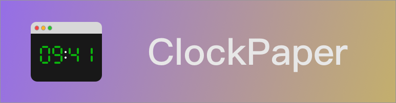
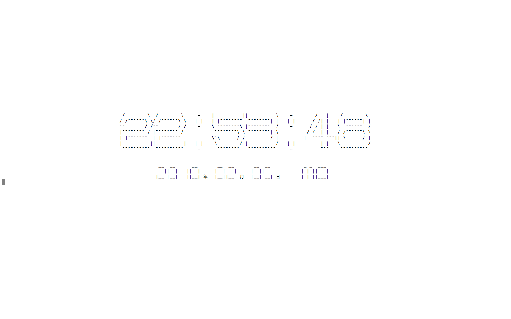

# ClockPaper


[](LICENSE.txt)
[](https://pypi.python.org/pypi/CloclPaper/1.0)
[]()

A python application in shell to show current time and date.You can use it as a wallpaper.

## Install
### 1.use `pip` to install it
`pip install ClockPaper`

### 2.download this project and use `setup.py`
```shell
$ cd ClockPaper
$ python setup.py install
```

## Requirements
It needs another my project [alphabetPy](https://github.com/RayZhao1998/alphabetPy),it'll be installed when you install `ClockPaper`

## Usage
You just need to use the command `ClockPaper`, and you'll see a digital clock and date.

However, I haven't known how to change the location according to the size of terminal, so I just use `\n`and space to make it in middle.

If your computer is 13 inch, you can make your terminal full screen to have a better user experience.

for example:



## License
### The MIT License (MIT)

CopyRight (c) 2018 Ray Zhao &lt;<a href="rayzhao98@163.com">rayzhao98@163.com</a>&gt;

Permission is hereby granted, free of charge, to any person obtaining a copy
of this software and associated documentation files (the "Software"), to deal
in the Software without restriction, including without limitation the rights
to use, copy, modify, merge, publish, distribute, sublicense, and/or sell
copies of the Software, and to permit persons to whom the Software is
furnished to do so, subject to the following conditions:

The above copyright notice and this permission notice shall be included in
all copies or substantial portions of the Software.

THE SOFTWARE IS PROVIDED "AS IS", WITHOUT WARRANTY OF ANY KIND, EXPRESS OR
IMPLIED, INCLUDING BUT NOT LIMITED TO THE WARRANTIES OF MERCHANTABILITY,
FITNESS FOR A PARTICULAR PURPOSE AND NONINFRINGEMENT. IN NO EVENT SHALL THE
AUTHORS OR COPYRIGHT HOLDERS BE LIABLE FOR ANY CLAIM, DAMAGES OR OTHER
LIABILITY, WHETHER IN AN ACTION OF CONTRACT, TORT OR OTHERWISE, ARISING FROM,
OUT OF OR IN CONNECTION WITH THE SOFTWARE OR THE USE OR OTHER DEALINGS IN
THE SOFTWARE.

